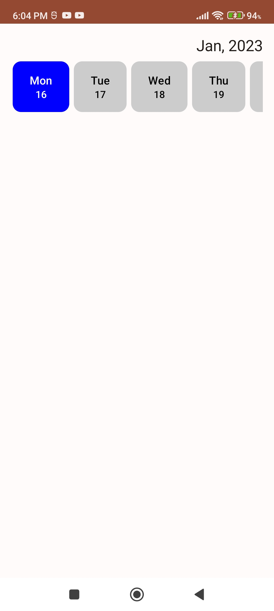

<h1 align="center">HorizontalCalendarView</h1></br>

<p align="center">
:calendar: A Jetpack Compose Horizontal Calendar View Library for your Android projects.
</p>
</br>

## Including it in your project:

### Step 1. Add the JitPack repository to your `settings.gradle` file
```gradle
    allprojects {
        repositories {
            ...
            maven { url 'https://jitpack.io' }
        }
    }
```

### Step 2. Add the dependency
```gradle
    dependencies {
        implementation 'com.github.JoelKanyi:HorizontalCalendarView:1.0.3'
    }
```

### Usage
Add the `HorizontalCalendarView` composable into your project and customize it according to your needs:
```kotlin
HorizontalCalendarView(
    modifier = Modifier,
    selectedTextColor = Color.White,
    unSelectedTextColor = Color.Black,
    selectedCardColor = Color.Blue,
    unSelectedCardColor = Color.LightGray,
    onDayClick = { day ->
        Toast.makeText(context, day.toString(), Toast.LENGTH_SHORT).show()
    }
)
```

### Demo

</br>

### License
```xml
Copyright 2023 Joel Kanyi

Licensed under the Apache License, Version 2.0 (the "License");
you may not use this file except in compliance with the License.
You may obtain a copy of the License at

   http://www.apache.org/licenses/LICENSE-2.0

Unless required by applicable law or agreed to in writing, software
distributed under the License is distributed on an "AS IS" BASIS,
WITHOUT WARRANTIES OR CONDITIONS OF ANY KIND, either express or implied.
See the License for the specific language governing permissions and
limitations under the License.
```
